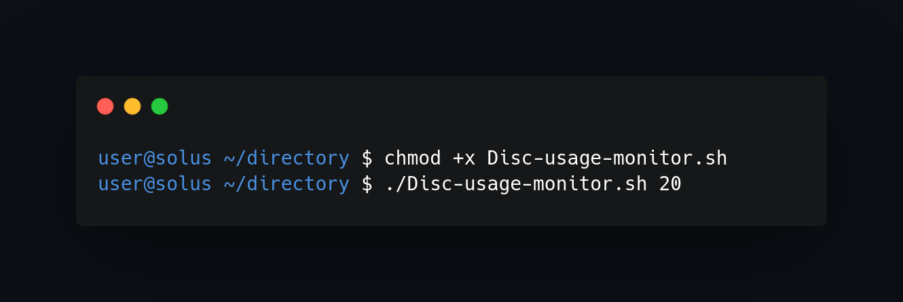
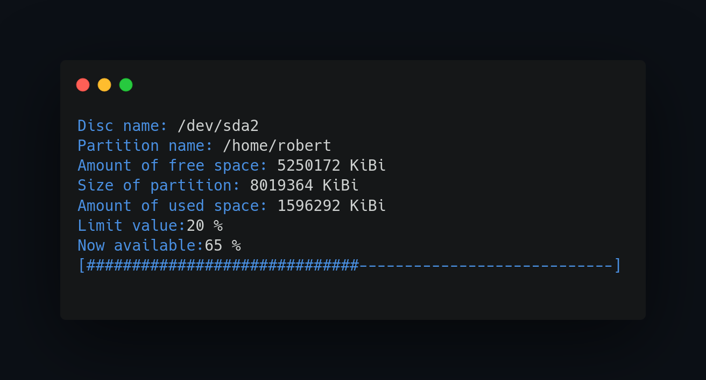

## What project do?
___

Script monitors free space at /home/user and tries to maintain percentage given by user as parameter and tries to maintain it (if free space is lower than given by user in % script deletes files or moves it to external usb storage).

Calling the script should be made with one argument in the range 5% -90% (otherwise the script returns error code)

NOTE - the script does not tolerate files with empty spaces in their names (they must be moved separately) - this is due to the fact that I use the awk command, which takes fields from a table.

Error codes:
1 - value too small (less than 5%)
2 - value too big (more than 90%)

## How to use?
___
To start script just add execute privillages and execute script with argument between 5-90 %

## Script execution
___
Script clears terminal to ensure that output is not messy.

<!--https://banner.godori.dev/-->
<!--https://shields.io/-->
<!--https://carbon.now.sh/-->